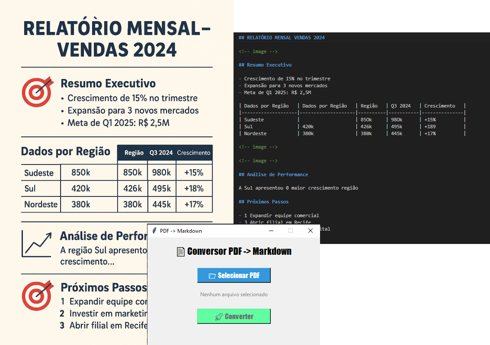

# 📄 Conversor PDF → Markdown

Conversor simples e eficiente para transformar documentos PDF em Markdown usando Docling.



## 🚀 Funcionalidades

- ✅ **Interface simples** - Apenas selecionar e converter
- ⚡ **Rápido e eficiente** - Powered by Docling AI
- 📊 **Preserva estrutura** - Mantém tabelas, títulos e formatação
- 🎯 **Foco no essencial** - Sem complicações desnecessárias

## 🔧 Instalação

### Pré-requisitos
- Python 3.9+
- pip

### Passos

1. **Clone o repositório:**
```bash
git clone https://github.com/seu-usuario/conversor-pdf-markdown.git
cd conversor-pdf-markdown
```

2. **Instale as dependências:**
```bash
pip install -r requirements.txt
```

3. **Execute o programa:**
```bash
python pdf_para_markdown.py
```

## 💻 Como usar

1. Execute o programa
2. Clique em "📁 Selecionar PDF" 
3. Escolha seu arquivo PDF
4. Clique em "🚀 Converter"
5. Pronto! O arquivo `.md` será salvo na mesma pasta

## 🛠️ Tecnologias

- **Python** - Linguagem principal
- **Tkinter** - Interface gráfica
- **Docling** - IA para conversão de documentos
- **IBM Research** - Modelos de layout e OCR

## 📋 Requisitos

- Sistema operacional: Windows, macOS, Linux
- Python 3.9 ou superior
- Conexão com internet (primeira execução)

## 🎯 Casos de uso

- **Documentação** - Converter manuais PDF para Markdown
- **Relatórios** - Transformar dados estruturados
- **IA/RAG** - Preparar documentos para modelos de linguagem
- **Blogs** - Converter conteúdo para publicação

## ⚠️ Limitações

- Imagens são convertidas para `<!-- image -->`
- Gráficos complexos não são interpretados
- Melhor resultado com PDFs de texto estruturado

## 🤝 Contribuições

Contribuições são bem-vindas! Sinta-se à vontade para:

- Reportar bugs
- Sugerir melhorias
- Enviar pull requests

## 📄 Licença

Este projeto está sob a licença MIT. Veja o arquivo [LICENSE](LICENSE) para mais detalhes.

## 👨‍💻 Autor

**Lucas Ludwig**

- GitHub: https://github.com/lucas26042002
---

⭐ Se este projeto te ajudou, deixe uma estrela!
